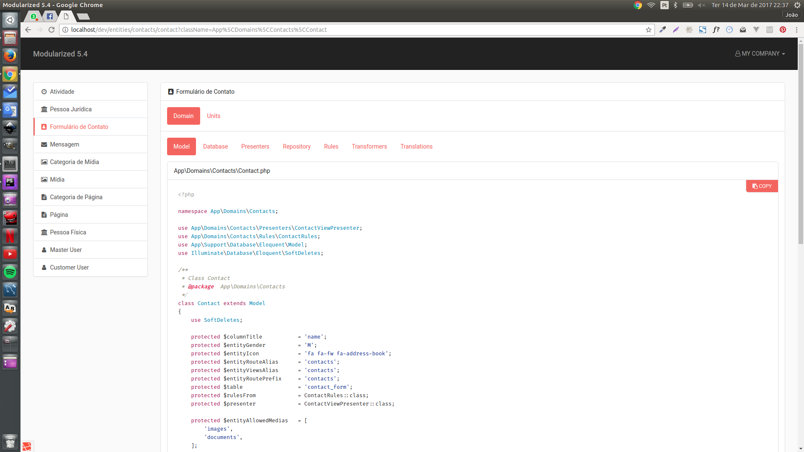

# modularized-5.4

### Install

Clone this repository
```
git clone https://github.com/joaosalless/modularized-5.4
```

Copy the .env-example file to .env.

```
cp .env.example .env
```

Adjust the settings according to your development environment in `.env` file.
If you are using docker-compose, adjust the settings according to your development environment in `docker-compose.yaml` file.

**If you are using docker-compose**

Start the docker containers
```
docker-compose up
```

Run migrations and seeds
```
docker-compose run app php artisan migrate:refresh --seed
```

**If you are using artisan serve**

Start the php development server
```
php artisan serve
```

Run migrations and seeds
```
php artisan migrate:refresh --seed
```

### Use
In your browser, go to `http://localhost:8000/dev` or `http://localhost/dev` if you are using docker-compose.

Default credentials are defined in App\Domains\Users\Master\Seeders\UserSeeder

```
Email: master@user.com
```

```
Password: 123456
```

All models will be listed in the side menu. Click on each model to inspect it.

### Screenshots

Model inspection



Routes inspection


Controllers inspection


## License

[MIT license](http://opensource.org/licenses/MIT).
